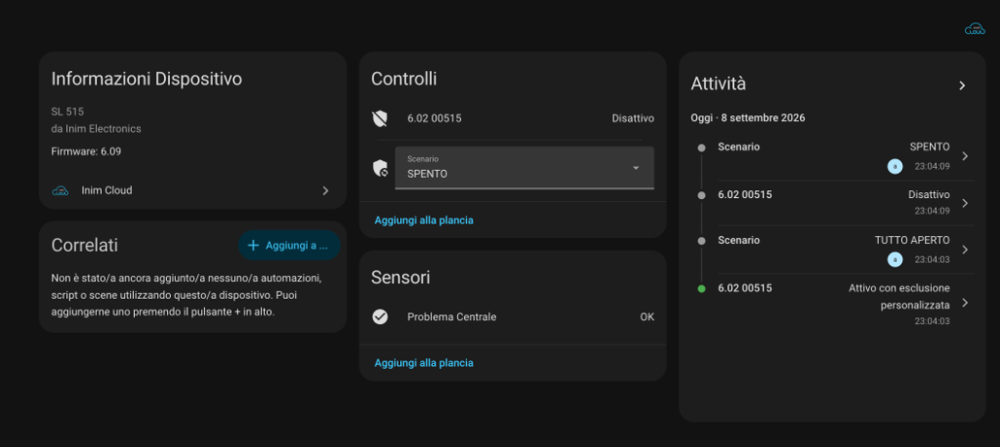

# Inim Cloud Alarm for Home Assistant

[](https://github.com/hacs/default)
[](https://github.com/mantovanellimatteo/Home-Assistant-INIM-Alarm/releases)
[](https://opensource.org/licenses/MIT)
[](#security--privacy)
[](#real-time-push-architecture)

A native, secure, and universal Home Assistant integration for **Inim Electronics** alarm systems (SmartLiving, Prime, Sol, etc.) communicating directly with **Inim Cloud**.

Eliminates the need for MQTT brokers, legacy bridges, or external daemons.

<p align="center">
  
</p>

---

## Key Features

* **Direct Cloud Connection:** Communicates natively with Inim Cloud over HTTPS and Secure WebSockets (WSS).
* **Real-Time Push Events:** Instant status updates (alarm triggers, scenario changes) through a persistent WebSocket stream.
* **Instance-Bound Credential Encryption:** Passwords are never stored in plaintext. They are encrypted at rest using AES-Fernet with keys tied to your specific Home Assistant instance UUID.
* **100% Dynamic Topology:** No hardcoded scenario IDs or panel identifiers. Automatically detects and imports all panels, scenarios, and physical zones linked to your account.
* **Native Alarm Control Panel:** Provides a standard `alarm_control_panel` entity compatible with Lovelace alarm cards, PIN verification, Apple HomeKit, Google Home, and Amazon Alexa.
* **Direct Scenario Selector:** A `select` dropdown exposing all panel scenarios for one-click activation.
* **Zone & Diagnostic Sensors:** Automatically exposes physical zones (doors, windows, PIR motion sensors) and panel trouble/fault status as `binary_sensor` entities.
* **Interactive Options Flow:** Customize scenario mappings (`disarmed`, `armed_away`, `armed_home`, `armed_night`, `armed_vacation`) directly from the Home Assistant UI without restarting.
* **Multilingual:** Full support for both English and Italian.

---

## Security & Privacy

This integration was designed from the ground up with a strict security-first architecture:

1. **Encrypted in Transit (TLS 1.2 / 1.3):**
   * All REST endpoints (`https://api.inimcloud.com`) and WebSocket streams (`wss://ws.inimcloud.com`) enforce TLS encryption with strict X.509 CA certificate chain validation. No insecure certificate bypasses (`CERT_NONE`) are permitted.
2. **Encrypted at Rest (AES-Fernet):**
   * Passwords stored in Home Assistant storage (`.storage/core.config_entries`) are encrypted using a Fernet key derived from your unique Home Assistant instance ID (`hass.data['core.uuid']`). Even if a configuration backup is leaked or extracted, stored credentials remain unreadable.
3. **Least Privilege Session Tokens:**
   * Passwords are only decrypted in volatile memory during the initial handshake (`RegisterClient`). All subsequent API queries, scenario activations, and WebSocket streams use short-lived session tokens.
4. **Log Sanitization:**
   * An integrated redaction filter automatically masks passwords, session tokens, PINs, and authentication headers (`***REDACTED***`) across all log messages, even when `DEBUG` logging is enabled.

---

## Architecture Overview

```
┌─────────────────────────────────────────────────────────┐
│                    Home Assistant Core                  │
│                                                         │
│  ┌─────────────────────────┐   ┌─────────────────────┐  │
│  │   alarm_control_panel   │   │    select entity    │  │
│  │   (Native Lovelace /    │   │  (All panel native  │  │
│  │    HomeKit / Alexa)     │   │      scenarios)     │  │
│  └────────────┬────────────┘   └──────────┬──────────┘  │
│               │                           │             │
│               ▼                           ▼             │
│         ┌───────────────────────────────────────┐       │
│         │       InimDataUpdateCoordinator       │       │
│         │    (State Cache & Push Distributor)   │       │
│         └───────────────────┬───────────────────┘       │
│                             │                           │
│                             ▼                           │
│         ┌───────────────────────────────────────┐       │
│         │             InimApiClient             │       │
│         │      (AES Decryption & HTTP/WSS)      │       │
│         └───────────────┬───────▲───────────────┘       │
└─────────────────────────┼───────┼───────────────────────┘
          HTTPS REST (TLS)│       │Persistent WSS (TLS Push)
          ActivateScenario│       │Real-time events
          GetDevices      │       │State sync
                          ▼       │
        ┌───────────────────────────────────────────┐
        │                 Inim Cloud                │
        │   api.inimcloud.com / ws.inimcloud.com    │
        └─────────────────────┬─────────────────────┘
                              │
                              ▼
        ┌───────────────────────────────────────────┐
        │         Physical Inim Alarm Panel         │
        │     (SmartLiving / Prime / Sol LAN)       │
        └───────────────────────────────────────────┘
```

---

## Installation

### Method 1: Via HACS (Recommended)

1. Ensure [HACS (Home Assistant Community Store)](https://hacs.xyz/) is installed.
2. In Home Assistant, open **HACS** > **Integrations**.
3. Click the three dots (top right) and select **Custom repositories**.
4. Enter the repository URL:
   ```
   https://github.com/mantovanellimatteo/Home-Assistant-INIM-Alarm
   ```
5. Select **Integration** as the Category and click **Add**.
6. Find **Inim Cloud Alarm** in HACS, click **Download**, and restart Home Assistant.

### Method 2: Manual Installation

1. Download the latest release `.zip` from the [Releases](https://github.com/mantovanellimatteo/Home-Assistant-INIM-Alarm/releases) page.
2. Extract and copy the `custom_components/inim_cloud` directory to your Home Assistant configuration directory:
   ```
   <config_dir>/custom_components/inim_cloud/
   ```
3. Restart Home Assistant.

---

## Configuration

1. In Home Assistant, navigate to **Settings** > **Devices & Services**.
2. Click **+ Add Integration** in the bottom right corner.
3. Search for **Inim Cloud** and select it.
4. Enter your Inim Cloud **Email / Username** and **Password**.
5. Click **Submit**. The integration will validate credentials with Inim Cloud, encrypt the password at rest, and discover all devices.

### Customizing Scenario Mappings (Options Flow)

Because every installation has different scenario names and configurations, you can easily map your panel's scenarios to standard Home Assistant alarm states:

1. Go to **Settings** > **Devices & Services** > **Inim Cloud**.
2. Click **Configure**.
3. Use the dropdown menus to select which scenario activates for each mode:
   * **Disarmed** (e.g. *SPENTO* / *Disarm*)
   * **Armed Away** (e.g. *ON TOTALE* / *Away*)
   * **Armed Home** (e.g. *NO CAMERE* / *Stay*)
   * **Armed Night** (e.g. *NOTTE* / *Night*)
   * **Armed Vacation** (e.g. *VACANZA*)
4. Click **Submit**. Changes apply immediately without requiring a restart.

---

## Entities Provided

| Platform | Entity Name | Description |
| :--- | :--- | :--- |
| `alarm_control_panel` | `alarm_control_panel.inim_alarm_<id>` | Full alarm control with Arm Away, Arm Home, Arm Night, and Disarm controls. |
| `button` | `button.<scenario_name>` | Dedicated one-click button for each native scenario (e.g. *ON TOTALE*, *SPENTO*). |
| `select` | `select.inim_alarm_<id>_scenario` | Dropdown selector displaying and activating any panel scenario directly. |
| `sensor` | `sensor.inim_last_event_<id>` | Real-time last event description, category, and metadata from Inim Cloud. |
| `sensor` | `sensor.inim_voltage_<id>` | Power supply and backup battery voltage in Volts (e.g. *13.80 V*). |
| `binary_sensor` | `binary_sensor.inim_fault_sensor_<id>` | Diagnostic sensor reporting trouble, tamper, or fault states on the panel. |
| `binary_sensor` | `binary_sensor.inim_zone_<id>_<zone_id>` | Individual physical zone sensors (Door, Window, Motion) with open/alarm states. |

---

## Automation Examples

Home Assistant allows you to automate your Inim alarm either using the user interface or YAML.

### 1. Activating a Specific Scenario (Recommended)

Each scenario has its own dedicated **Button** entity, making automations extremely straightforward.

**Via UI:**
* **Action:** Select **Device** > Choose your **Inim Alarm** > Action: **Press `<Scenario Name>`** (e.g. *Press ON TOTALE*).

**Via YAML:**
```yaml
alias: "Alarm - Arm Night Scenario at 23:00"
trigger:
  - trigger: time
    at: "23:00:00"
action:
  - action: button.press
    target:
      entity_id: button.no_camere
```

### 2. Standard Alarm Arming / Disarming

You can also use standard alarm services mapped to your configured scenarios.

**Via YAML:**
```yaml
alias: "Alarm - Disarm when arriving home"
trigger:
  - trigger: zone
    entity_id: person.admin
    zone: zone.home
    event: enter
action:
  - action: alarm_control_panel.alarm_disarm
    target:
      entity_id: alarm_control_panel.inim_alarm_panel_1202
```

### 3. Send a Notification on Trouble / Tamper

Receive an instant smartphone notification if the central reports any fault or tamper event:

**Via YAML:**
```yaml
alias: "Notification - Inim Alarm Trouble Detected"
trigger:
  - trigger: state
    entity_id: binary_sensor.problema_centrale
    to: "on"
action:
  - action: notify.notify
    data:
      title: "Inim Alarm Warning"
      message: "The alarm panel has reported a fault or tamper state!"
```

### 4. Real-Time Push Notifications on Central Events (via `inim_cloud_event`)

Whenever any event occurs on your Inim alarm panel (disarming from keypad, zone alarms, user codes), the integration emits an `inim_cloud_event` into the Home Assistant event bus with detailed contextual information.

**Via YAML:**
```yaml
alias: "Notification - Inim Real-Time Event"
trigger:
  - trigger: event
    event_type: inim_cloud_event
action:
  - action: notify.notify
    data:
      title: "Inim Cloud - {{ trigger.event.data.category }}"
      message: "{{ trigger.event.data.info }} ({{ trigger.event.data.timestamp }})"
```

---

## Debugging & Logs

To enable verbose debug logging for this integration, add the following to your `configuration.yaml`:

```yaml
logger:
  default: info
  logs:
    custom_components.inim_cloud: debug
```

> **Note:** Sensitive data such as passwords, tokens, and PINs are automatically redacted from logs.

---

## Contributing

Contributions, issues, and feature requests are welcome! Feel free to check the [Issues page](https://github.com/mantovanellimatteo/Home-Assistant-INIM-Alarm/issues).

---

## License

This project is licensed under the MIT License - see the [LICENSE](LICENSE) file for details.
